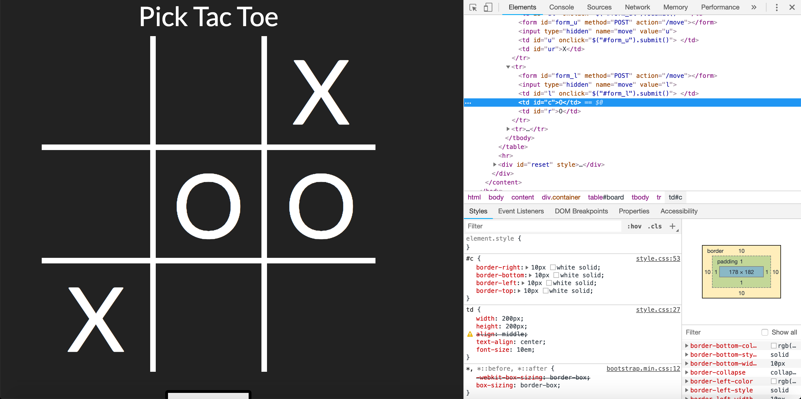

# Pick-Tac-Toe

Web | 75 points

To solve this challenge we must beat the computer at tic tac toe.
It's impossible to beat a properly written computer, so instead 
you have to hack it.

First we notice that when we click a square, a form is submitted to
`/move` with the location of the square (`l`, `c`, or `r` for the row,
and `u`, `b`, or nothing preceding for the top, bottom, or center rows respectively).
For example, the center square is just `c`, and the top left square is `ul`.

```html
<!-- HTML for the empty bottom row of a tic tac toe board -->
<tr>
	<form id="form_ul" method="POST" action="/move"></form>
	<input type="hidden" name="move" value="ul">
	<td id="ul" onclick="$('#form_ul').submit()"> </td>
	
	<form id="form_u" method="POST" action="/move"></form>
	<input type="hidden" name="move" value="u">
	<td id="u" onclick="$('#form_u').submit()"> </td>

	<form id="form_ur" method="POST" action="/move"></form>
	<input type="hidden" name="move" value="ur">
	<td id="ur" onclick="$('#form_ur').submit()"> </td>

</tr>
```

The thing stopping us from clicking on an already submitted square
is simply that the form does not exist.



We can try resubmitting a already filled square (the center square above)  to get three in a row.
```js
$.post("/move", {
	move:"c"
});
```

It works! The server returns the flag once we run this in the console.


```
CTF{i_beat_the_impossible}
```
